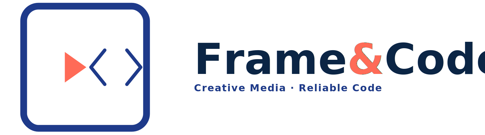

FRAME&CODE — LOGO (Royal Blue + Coral)
================================================

Concept
-------
Rounded rectangle (Frame) encasing a **Play** triangle (media) beside **<>** chevrons (code).
This differs from Variant 1 (corner frame + </> slash).

Palette
-------
- Primary (Royal Blue): #1E3A8A
- Accent  (Coral):      #FF6B57
- Dark BG suggestion:   #0B1220
- Light surface:        #F7F8FA

Usage
-----
- Use *logo_horizontal_v2_dark.svg* on light backgrounds.
- Use *logo_horizontal_v2_on_darkbg.svg* for dark headers/hero sections.
- *icon_mark_v2.svg* works for avatars and favicons.

Tagline
-------
Included "Frame · Edit · Build". You can edit in the SVG <text> element.
